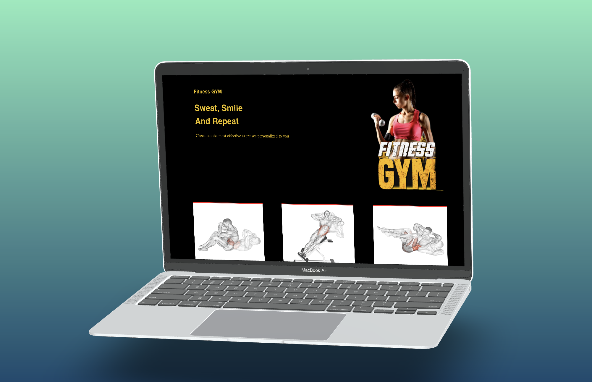
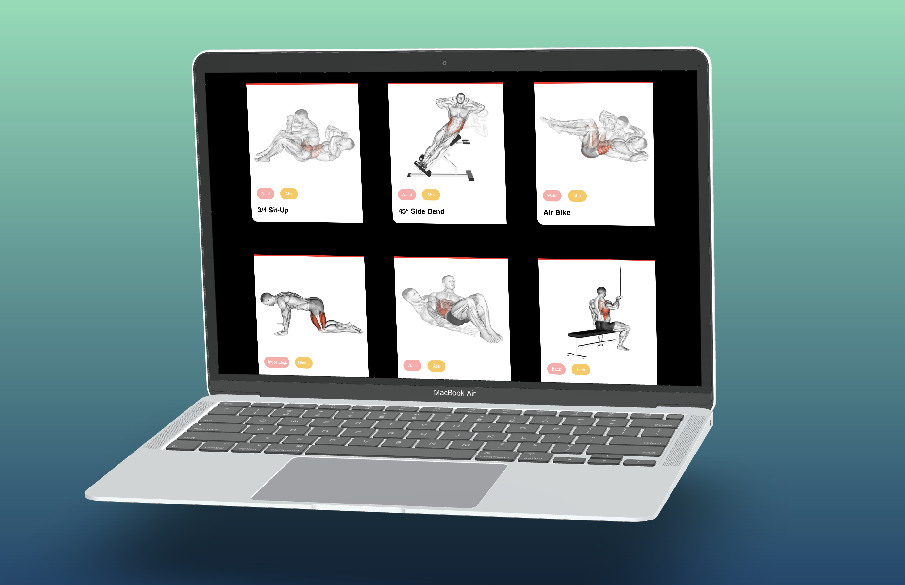
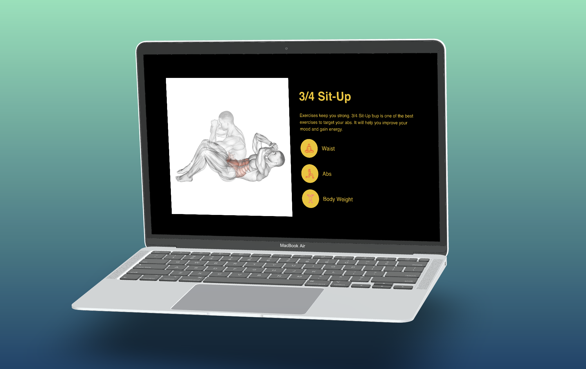
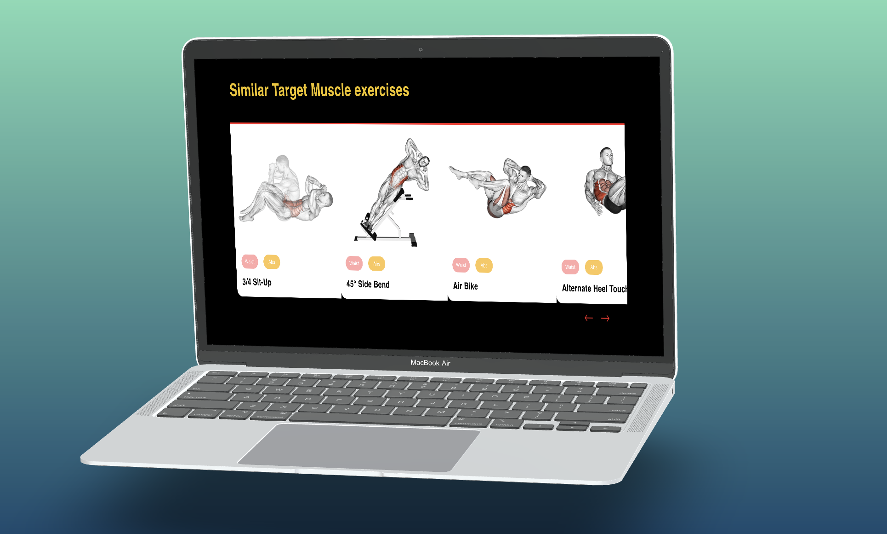
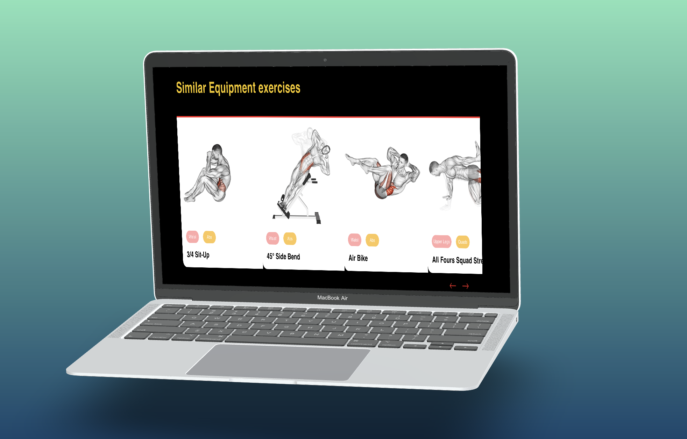

## Building a React app with material ui, RapidApi, TypeScript and redux toolkit 
This is a repository for react fitness app using React, material ui, RapidApi, TypeScript and redux toolkit 

## Technologies
- React.js
- Beautiful layouts with material ui
- Create reusable components
- State management with redux toolkit
- RapidApi

  
## 🔐 Setup .env file
REACT_APP_URL

CLERK_SECRET_KEY

REACT_APP_RAPIDE_KEY

NEXT_PUBLIC_CLERK_SIGN_UP_URL

REACT_APP_RAPIDE_HOST

## Screenshot







### :running: Run Locally

Clone the project

```bash
  git clone https://github.com/badiniibrahim/react_fitness_app.git
```

Install dependencies
```bash
  yarn install
```

## Getting Started
```bash
  yarn start
```

### Learn More

To learn more about Next.js, take a look at the following resources:

- [Next.js Documentation](https://nextjs.org/docs) - learn about Next.js features and API.
- [Learn Next.js](https://nextjs.org/learn) - an interactive Next.js tutorial.

You can check out [the Next.js GitHub repository](https://github.com/vercel/next.js/) - your feedback and contributions are welcome!

<!-- Deployment -->

### :triangular_flag_on_post: Deployment

To deploy this project run

##### Deploy on Vercel

The easiest way to deploy your Next.js app is to use the [Vercel Platform](https://vercel.com/new?utm_medium=default-template&filter=next.js&utm_source=create-next-app&utm_campaign=create-next-app-readme) from the creators of Next.js.

Check out our [Next.js deployment documentation](https://nextjs.org/docs/deployment) for more details.


